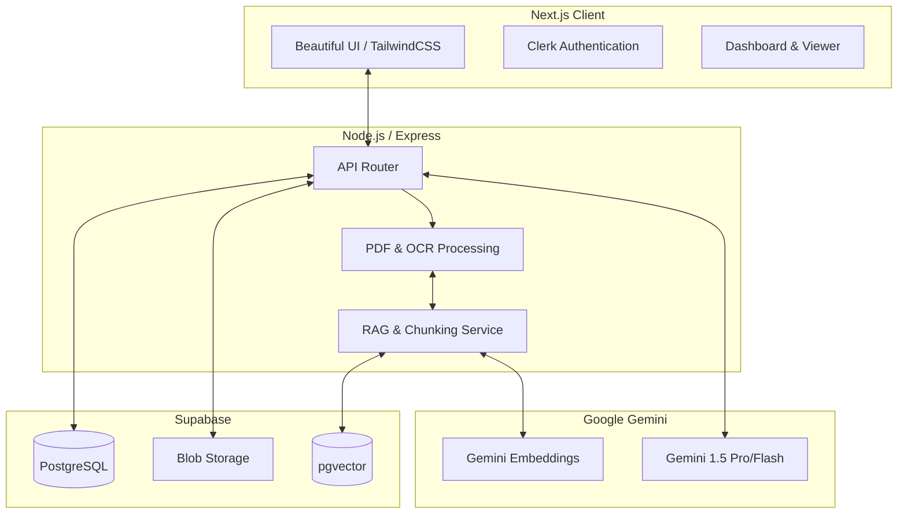
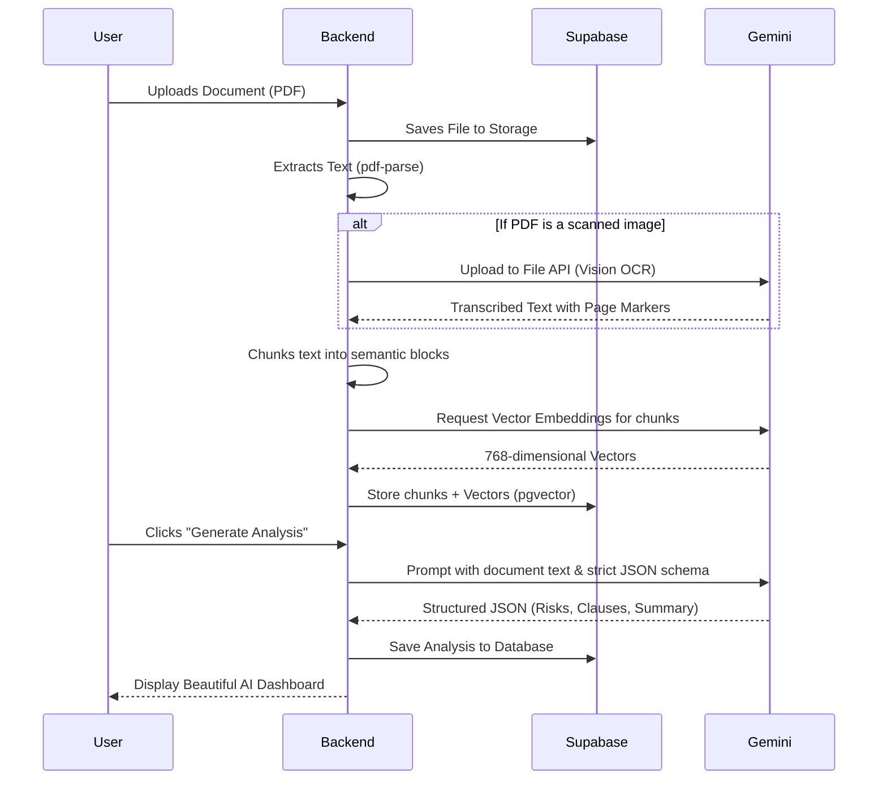

<div align="center">
  
  
  # ⚖️ NyayLens
  
  **Making Legal Information Accessible, Understandable, and Actionable with GenAI.**
</div>

<br />

> **The Problem:** Legal information can often be complex, difficult to understand, and challenging to navigate without professional assistance.
> 
> **The Solution:** NyayLens is a GenAI-powered legal assistant that empowers everyday users to understand, compare, and navigate complex legal documents effortlessly. It translates legalese into plain language, highlights critical risks, and prepares you for professional legal consultations.

---

## ✨ Features

- 📑 **Smart AI Analysis**: Instantly generate 2-3 sentence summaries of complex documents. Automatically extract parties involved, important dates, financial amounts, rights, and obligations.
- 🚨 **Risk Assessment (Attention Areas)**: Highlights unusual terms, skewed clauses, and potential risks, assigning them a Low/Medium/High severity level.
- 🔍 **Interactive Document Q&A**: Chat directly with your contract. Uses Retrieval-Augmented Generation (RAG) to answer questions with precise page citations.
- ⚖️ **Contract Comparison**: Upload two documents side-by-side. The AI instantly highlights differences, inconsistencies, and modified clauses.
- 📷 **Native Vision OCR**: Built-in support for scanned, image-only PDFs using Gemini 1.5 Multimodal Vision.
- ✅ **Actionable Outputs**: Automatically generates step-by-step checklists based on obligations and drafts smart "Questions for your Lawyer."

---

## 🎯 Problem Statement Alignment

NyayLens is a GenAI-powered solution explicitly designed to make legal information and basic legal assistance more accessible. It empowers users to understand, compare, and navigate legal documents and information through the following key use cases:

- **Simplifying complex legal documents**: Translates dense legal jargon into plain-language summaries so anyone can understand what they are signing.
- **Comparing contracts, agreements, or policies**: Our side-by-side comparison feature automatically detects modifications and highlights inconsistencies between versions of a contract.
- **Highlighting important clauses, obligations, risks, or inconsistencies**: The "Attention Areas" scanner specifically flags risky clauses, financial obligations, and unusual terms that require review.
- **Answering questions based on provided legal documents**: The interactive RAG-based chat allows users to ask open-ended questions about their uploaded documents and receive accurate answers with citations.
- **Helping users understand their options and potential next steps**: The AI generates contextual advice on what actions a user should consider based on the document's contents.
- **Generating summaries, checklists, or other actionable outputs**: Automatically creates compliance checklists and obligation trackers from raw contracts.
- **Helping users prepare information or questions for a legal professional**: NyayLens generates a curated list of "Questions to ask your lawyer" to ensure users are fully prepared for professional legal consultations.

---

## 🏗️ High-Level Architecture

NyayLens is built on a modern, highly scalable full-stack architecture utilizing vector embeddings for semantic search.



---

## ⚙️ How It Works: The Processing Pipeline

When a user uploads a document, NyayLens orchestrates a sophisticated background pipeline to prepare the document for AI interaction.



---

## 🛠️ Tech Stack

### Frontend
- **Framework:** Next.js (App Router)
- **Styling:** TailwindCSS, Shadcn/UI
- **Language:** TypeScript
- **PDF Rendering:** `react-pdf`

### Backend
- **Framework:** Node.js, Express
- **AI/LLM:** Google Generative AI SDK (`gemini-1.5-flash`, `gemini-embedding-2`)
- **Database ORM:** Supabase JS Client

### Database
- **Provider:** Supabase (PostgreSQL)
- **Vector Search:** `pgvector` extension for semantic Q&A

---

## 🚀 Running Locally

1. **Clone the repository**
2. **Install dependencies**
   ```bash
   npm install
   ```
3. **Setup Environment Variables**
   Create a `.env` file in both `frontend` and `backend` directories with your Supabase credentials and Gemini API Key.
4. **Start the development server**
   ```bash
   npm run dev
   ```
   *This starts the Next.js frontend, Node backend, and TypeScript watcher concurrently via Turborepo.*

---

<div align="center">
  <i>Disclaimer: NyayLens provides AI-assisted information and tools to help users understand legal documents. It does not provide, nor should it replace, professional legal advice from a qualified attorney.</i>
</div>
